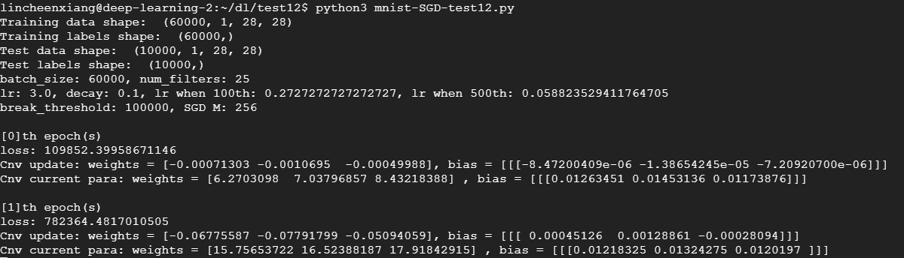
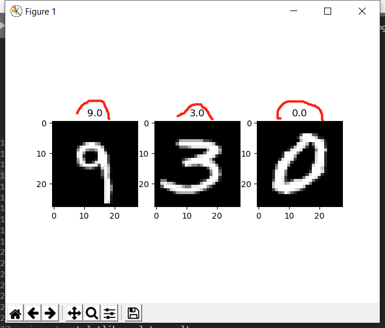
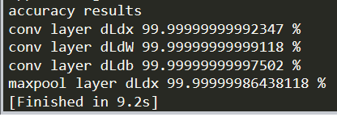
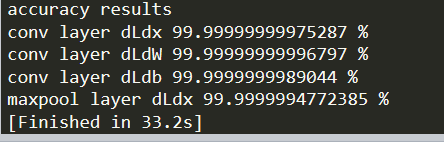

# Introduction
这是主要基于python的numpy实现的卷积神经网络(convolutional neural network)，具体内容可查看作业说明PDF~  

本卷积神经网络基于 [Mini-SGD](https://en.wikipedia.org/wiki/Stochastic_gradient_descent) + [1/t decay](https://www.jianshu.com/p/d8222a84613c) + [RMSProp](https://zhuanlan.zhihu.com/p/79981927) 实现  

关于CNN的说明可以参考[这篇文章](https://medium.com/@pkqiang49/%E4%B8%80%E6%96%87%E7%9C%8B%E6%87%82%E5%8D%B7%E7%A7%AF%E7%A5%9E%E7%BB%8F%E7%BD%91%E7%BB%9C-cnn-%E5%9F%BA%E6%9C%AC%E5%8E%9F%E7%90%86-%E7%8B%AC%E7%89%B9%E4%BB%B7%E5%80%BC-%E5%AE%9E%E9%99%85%E5%BA%94%E7%94%A8-6047fb2add35)。讲的很好很有意思也没有涉及太多拗口难懂的知识。

## 运行截图  

**运行时的样子**  
<div  align="center">   
    
</div> 

**Input**: (6+1)万张28x28x1的手写数字图片
<div  align="center">   
    
</div>  

**output**: 随机选择的num_plot张带着label的输出
<div  align="center">   
    
</div>

# 项目说明  

**首先感谢一个朋友，自己的电脑太烂所以用他的电脑帮我跑，帮了很大的忙。 感谢🦀🦀。**  
* 总共有两个py文件：nn.py和mnist.py   
    * nn.py 负责实现convolutional_layer和max_pooling_layer两个layers的正确与否测试。  
    * mnist.py 负责图像识别的整个卷积神经网络模型构建（主要内容在这）。  
    
    
* 模型运行的流程  

    **下面是设定的各种参数**  

```
# 一些开关参数
load_para               # True表示加载已有卷积核，False表示使用随机生成的卷积核
is_learning             # True表示学习，False表示只是测试图片
```  

```
# 模型的参数
num_plot                # 想测试的图片数量
sample_index            # batch_size张图中随机选num_plot张
predicted               # 预测函数将会放到这里
batch_size              # input图的数量
input_size              # 图大小（像素）
in_ch_size              # 图的depth (grayscale or RGB)
filter_width            # filter的size
filter_height = filter_width
num_filters             # filter数
class_num               # class数
num_train               # 训练数
lr                      # learning rate
cnv_lr = lr
fcl_lr = lr
decay                   # 1/t decay
break_threshold         # 当loss小于一定值时break的阈值
M                       # Mini-SGD的参数
cnvRMS_r_W = 0          # RMSProp的参数
fclRMS_r_W = 0
alpha
```  
    
 **下面是学习部分的代码介绍**  
```
# convolution layer
    
# 首先将图片输入到卷积层 (convolution layer)
cnv_out = cnv.forward(X）

# 卷积层结束后到达池化层，这里用的是最大池 (maxpool)
mpl_out = mpl.forward(cnv_out)

# 池化结束之后进入全连接层 (fully connect layer)
fcl_out = fcl.forward(mpl_out)  # shape = (batch_size, in_ch_size(class_num), mpl_out_size, ~)

# 通过softmax和cross-entropy 计算loss损失函数
# softmax layer
smax_in = fcl_out.reshape(batch_size, class_num).T
smax_out = smax.forward(smax_in)    # shape = (class_num, batch_size)

# 记录损失函数cent loss
loss_out[ntrain] = cent.forward(smax_out, y)

# 开始计算梯度进行反向传播
# back smax and cent layer
b_smax_cent_out = cent.backprop(smax_out, y)    # (class_num, batch_size)

# 全连接层的反向传播
# back fully connect layer
b_fcl_in = b_smax_cent_out.T.reshape(batch_size, class_num, 1, 1)
b_fcl_out, b_fcl_out_W, b_fcl_out_b = fcl.backprop(mpl_out, b_fcl_in)

# 池化层的反向传播
# back max pool layer
b_mpl_out = mpl.backprop(cnv_out, b_fcl_out)

# 卷积层的反向传播
# back convolution layer
b_cnv_out, b_cnv_out_W, b_cnv_out_b = cnv.backprop(X, b_mpl_out)

# 将得到的梯度计算得到RMSProp参数，并对卷积核W和bias进行更新
# RMSProp
cnvRMS_r_W = (alpha*cnvRMS_r_W) + (1-alpha) * (b_cnv_out_W**2)
cnvRMS_W = (cnv_lr*b_cnv_out_W) / (cnvRMS_r_W**0.5+1e-7)
fclRMS_r_W = (alpha*fclRMS_r_W) + (1-alpha) * (b_fcl_out_W**2)
fclRMS_r = (fcl_lr*b_fcl_out_W) / (fclRMS_r_W**0.5+1e-7)

# update convolution layer
cnv.update_weights(-cnvRMS_W, -b_cnv_out_b*cnv_lr)

# update fully connect layer
fcl.update_weights(-fclRMS_r, -b_fcl_out_b*fcl_lr)

# 每次训练结束后会显示信息，如loss，第几次训练，以及部分的W和b的信息。
# show info
print()
print("[%s]th epoch(s)\nloss: %s" % (ntrain, loss_out[ntrain]))
print("Cnv update: weights = %s, bias = %s" % (b_cnv_out_W[0][0].reshape(filter_width**2)[13:16]*cnv_lr, b_cnv_out_b[0][1:4].T*cnv_lr))
cnv_current_para = cnv.get_weights()
print("Cnv current para: weights =", cnv_current_para[0][0][0].reshape(filter_width**2)[13:16], ", bias =", cnv_current_para[1][0][1:4].T)

# 设置loss检测，loss小于一定值之后break。
if ntrain > 10:
    if loss_out[ntrain-1]+loss_out[ntrain-2]+loss_out[ntrain-3] < break_threshold:
         break

# 最后通过1/t decay对learning rate进行调整
# 1/t decay
cnv_lr = lr * 1.0 / (1.0+decay*ntrain)
fcl_lr = cnv_lr
    
# 学习结束，进行下一次的学习。
```  

**下面是预测的过程**  

```
# 因为每次只预测一张图所以把batch_size设置成1
batch_size = 1
# 对num_plot张图进行预测
for i in range(num_plot):
    # input数据的shape调整
    pred_cnv_in = X[sample_index[i]].reshape(1, in_ch_size, input_size, input_size)
    
    # 进入卷积层
    pred_cnv_out = cnv.forward(pred_cnv_in)
    
    # 池化层
    pred_mpl_out = mpl.forward(pred_cnv_out)

    # 全连接层
    pred_fcl_out = fcl.forward(pred_mpl_out)
    
    # softmax将结果映射到10个classes上，概率最大的就是预测的class
    pred_smax_in = pred_fcl_out.reshape(batch_size, class_num).T
    pred_smax_out = smax.forward(pred_smax_in)

    # 将预测结果保存到predicted中
    predicted[i] = np.argmax(pred_smax_out)
```  

最后的话将结果通过plt输出得到上述的output中的样子。


## nn.py  
里面有nn_convolutional_layer和nn_max_pooling_layer两个classes，分别负责convolution和maxpool操作。  
每个class里主要有两个函数：forward和backward，forward负责执行操作，backward负责计算梯度。  
剩余的主体代码主要是生成数据来测试上面的两个classes是否能正常使用，以及调整各种数据后(ex: input_size, batch_size, filter_size等)代码是否依旧能运行等。  

### nn.py的运行结果  
#### batch_size设置为8时  
  
#### batch_size设置为32时(由于处理数据变多所以运行时间也变多了)  

  
  
## mnist.py  

#### 过程日记

##### Nov 24, 2020  
各个连接层可以连接，正常调整参数(input_size, filter_num, pool_size等)。  
但是对于池化层到全连接层的过度有点不是很明白，目前是池化层结束后再将其以一维reshape。
如有4个filter，池化层结束后的大小是6-by-6，所以reshape(4×6×6)，然后再乘W得到10个labels的值。  
loss是用softmax + cross-entropy来计算的，目前问题是loss优化到一定数值后就一直在这个数字波动了。  
由于教授只讲了convolution layer和pools layer。后面的操作先看看别人的思路再进行。姑且先上传保存下进度吧。  
  
##### Nov 25, 2020
把forward和backprop的过程修改了一点，目前可以认图了。  
但是电脑配置太差，只测试了学习50，100， 500，1000，5000张图的情况，均可以正常识别出图中的数字。  
学习的图片再多的话如10000张图没试过了跑了一天都没跑完。。。但是总共有6万张图，绝望。

##### Nov 27, 2020
昨晚把代码优化了，之前用的是GD，目前版本是基于mini-SGD + RMSProp + 1/t decay实现，  
速度大大加快一晚上就学完60000张学习资料并保存了卷积核。
现在已经可以拿来用了，学习时间有限+防止overfitting，  
目前把loss调整到三次的和低于500000就退出，所以正确率不是100%但是除了比较像的图片一般都能对了。  
后续还在优化中，不过差不多能提交了。  
谁能想到20分的项目作业梯度函数和建立模型17分，只占3分的正确识别图片却花了80%的时间和精力。😓